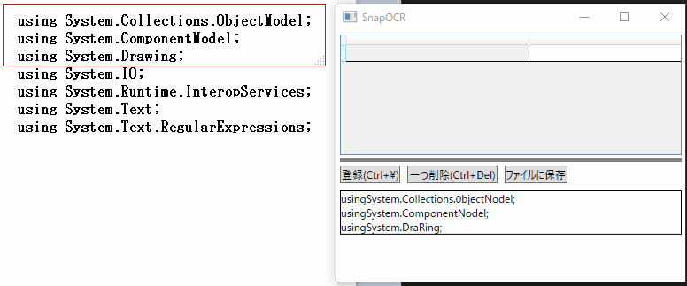

# SnapOCR

## 使い方

- 赤い枠線内の文字列をOCRで文字認識します

- 認識した文字は「登録」で上の表に登録できます

- 登録した文字は編集可能で、行の追加・削除も行えます

- 「ファイルに保存」で表の内容をテキストファイルに保存できます

- ショーカットキーによる操作はウィンドウが非アクティブでも使用可能です

## インストーラー

[最新のReleases](https://github.com/DamunGames/SnapOCR/releases)からダウンロードできます

## OCRについて

OCRはWindows SDKに含まれるWindows.Media.Ocrのものを使用しています

## 使用リソース
本プロジェクトは、以下のリソースを使用しています

- アイコン
  - アイコン名: Document Scanner
  - 出典: [Material Icons](https://fonts.google.com/icons)
  - 著作権者: Google
  - ライセンス: [Apache License 2.0](https://www.apache.org/licenses/LICENSE-2.0)